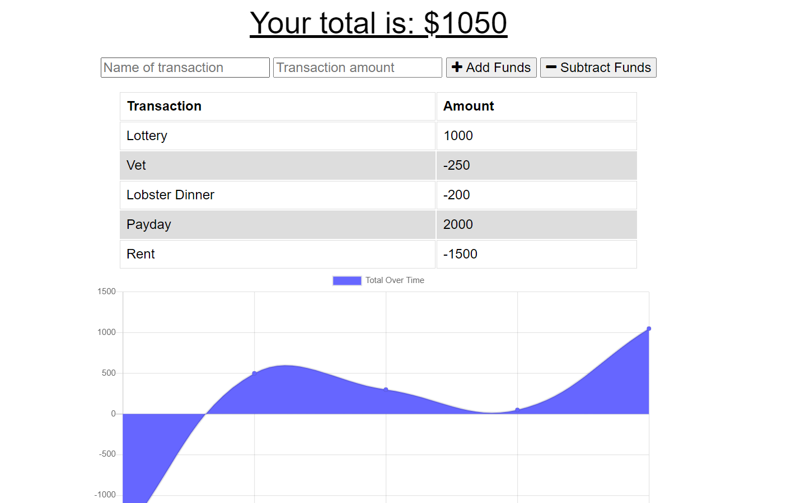

# budget_tracker_ECB

# Unit 18 PWA Homework: Offline Budget Tracker

For this assignment, you'll add functionality to our existing Budget Tracker application to allow for offline access and functionality.

The user will be able to add expenses and deposits to their budget with or without a connection. When entering transactions offline, they should populate the total when brought back online.

## Table of Contents

1. [Link](#link)
2. [Description](#description)
3. [Use](#use)
4. [Installation](#installation)
5. [Contributing](#contributing)
6. [Questions](#questions)
7. [Example](#example)

### Link

The link to the heroku app for this repo is:

```
https://let-me-budget-that-ecb.herokuapp.com/
```

### Description

The application will be invoked with the following command:

```sh
npm start
```

The user will be told what port the app is being served on and can go to localhost: in the web browser.

### Use

AS AN avid traveller
I WANT to be able to track my withdrawals and deposits with or without a data/internet connection
SO THAT my account balance is accurate when I am traveling

### Installation

Please run npm install to handle dependencies.

### Contributing

Contributions to this project are welcome.

### Questions

If you have an questions about the repo, open an issue or contact Elly Burgess directly at Eleanor.C.Burgess@gmail.com.

### Example


